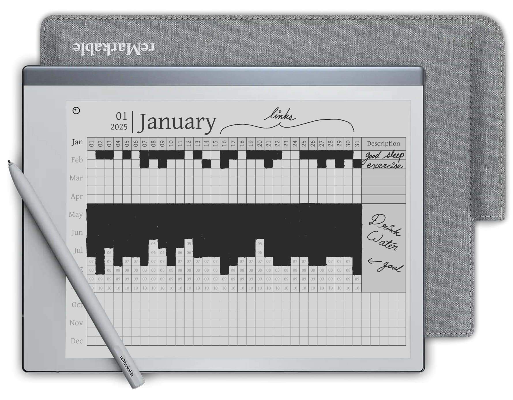

# ReMarkable Calender

## Images




## Contents

- [What is this?](#what-is-this)
    - [Features](#features)
- [How do I use this?](#how-do-i-use-this)
- [Using the creation script](#using-the-creation-script)
    - [Prerequisites](#prerequisites)
    - [Setup](#setup)
    - [Usage](#usage)
    - [Customization](#customization)
    - [Adding custom dates](#adding-custom-dates)

## What is this?

**LOOKING FOR DOWNLOADS?**  
[Click this link for a free PDF](https://github.com/elainajones/remarkable-calendar/releases/latest) (under the "Assets" drop-down)  

This is a minimalist PDF calendar for the ReMarkable 2 inspired by the  
Hobonichi Techo planner. The included code is for creating this  
calendar but most people will want to simply download a pre-made calendar  
from [the releases page](https://github.com/elainajones/remarkable-calendar/releases/latest).

### Features

- **Filled calendar** with "real" dates.
- 24-hour grid ruling for each day (perfect for scheduling).
- Habit tracker.
- Clickable links to each section.
    - Navigating between sections is always 1 click to make the most  
      of the Remarkable 2 performance (it can be slow).
- Supports custom date ranges.
    - 1 year, 5 years, etc.
- Support for [custom holidays/dates](#adding-custom-dates).
    - Common US holidays added by default.
- Supports both left and right toolbar placements.
    - For example, generate using `--toolbar-position right` for lefties.
- Custom week start.
    - Monday start, Sunday start, Taco Tuesday start. Whatever.
- [Gentium Font](https://software.sil.org/gentium/)
- Completely free and open-source!
    - Don't mind the spaghetti code (it had to be done)

## How do I use this?

To use, simply download a copy of the PDF and upload to the Remarkable 2.  
Once uploaded, open the PDF and **set the viewing for landscape mode**.  
Be sure to set the page scaling to fit the screen width.

Continue reading for instructions using the code included in this repository.

## Using the creation script

### Prerequisites

- [Python3](https://www.python.org/downloads/)
- [Git](https://git-scm.com/downloads)
- Basic familiarity with Python
- Basic familiarity with running shell commands

### Setup

1. Ensure that both Git and Python3 have been installed.
2. `git clone https://github.com/elainajones/remarkable-calendar.git`
    - This will download the code locally on your machine.
3. `cd remarkable-calendar`
4. `python3 -m venv venv`
    - This will create a [Python3 virtual environment](https://docs.python.org/3/library/venv.html).
5. `.\venv\Scripts\activate`
    - `(venv)` should appear in the shell.
    - Linux users only: `. venv/bin/activate`
6. `python3 -m pip install -r requirements.txt`
    - This will install necessary dependencies.

### Usage

The simplest way to run the code is to enter the following command.  
The current year will be automatically determined from your computer's  
date settings.

```
python3 main.py
```
*This assumes your Python interpreter is named `python3`.*

A calendar PDF will be created locally as `calendar.pdf`.

### Customization

The `-h` or `--help` option can be added to the end of the command to  
show additional options.

```
python3 main.py --help
```

This includes the following options to customize the calendar.

- `--toolbar-position OPTION`
    - `OPTION` should be either `left` (default) or `right` (lefty mode).
- `--start-date`
    - Human readable date with support for multiple formats
    - eg: `'2024/09/27'` or `'Sept 9, 2024'` (make sure to enclose inside `'`)
- `--end-date`
    - Human readable date with support for multiple formats
    - eg: `'2024/09/27'` or `'Sept 9, 2024'` (make sure to enclose inside `'`)

### Adding custom dates

Custom dates can be added to the calendar by editing the `dates.csv`  
file or supplying a custom path using the `--date-file` argument.  
The file `dates.csv` will contain examples you can use as reference.

- Dates are processed in the same order they are provided in `dates.csv`.
- If no "Long Description" is provided, the "Short description" will be  
  used instead.
- "Short Descriptions" should be kept under 16 chars for best results.
    - A longer description can still be added as the "Long Description".
- Fixed dates (any event that falls on the same day of the month).
    - "Order" MUST be left blank.
    - "Month", "Day", and "Short Description" columns MUST be filled.
- Non-fixed dates (dates that fall on the second Sunday of the month, etc)
    - "Day" MUST be left blank (the "Order" column is used instead).
    - "Month", "Week Day", "Order" columns need to be filled.
    - "Order" is order in which the event falls on a given "Week day".  
      For example, if an event falls on the 2nd Sunday of the "Month"  
      use 2 for the "Order". If an event falls on the last Friday of the  
      "Month" use -1. The second to last Friday is -2. Etc.

The following is the expected structure of the `dates.csv` file,  
including examples for dates you can add. For each row, it is normal for  
some columns to remain blank.

|Month|Day|Week Number|Week Day|Order|Short Description|Long Description         |
|----:|--:|----------:|:-------|----:|:----------------|:------------------------|
|1    |1  |           |        |     |New Year's       |Happy New year!          |
|1    |7  |           |        |     |Example Range 1  |Example Range 1          |
|1    |8  |           |        |     |                 |Example Range 1          |
|1    |8  |           |        |     |Example Range 2  |Example Range 2          |
|1    |9  |           |        |     |                 |                         |
|1    |9  |           |        |     |Example Range 2  |Example Range 2          |
|5    |   |           |Monday  |-1   |Memorial Day     |                         |

- Multiple events can be added for the same day.
    - These will be displayed one after the other in the same order they  
      are provided in `dates.csv`.
- A date range can be achieved by adding consecutive dates.
    - For overlapping ranges, a blank entry can be added for alignment  
      (refer to the example table above).
    - The short description can be left blank for the consecutive dates  
      if only the first day of the range should be labeled. The "Long  
      Description" will still be present on the day page for each.

For example, using the above table:

