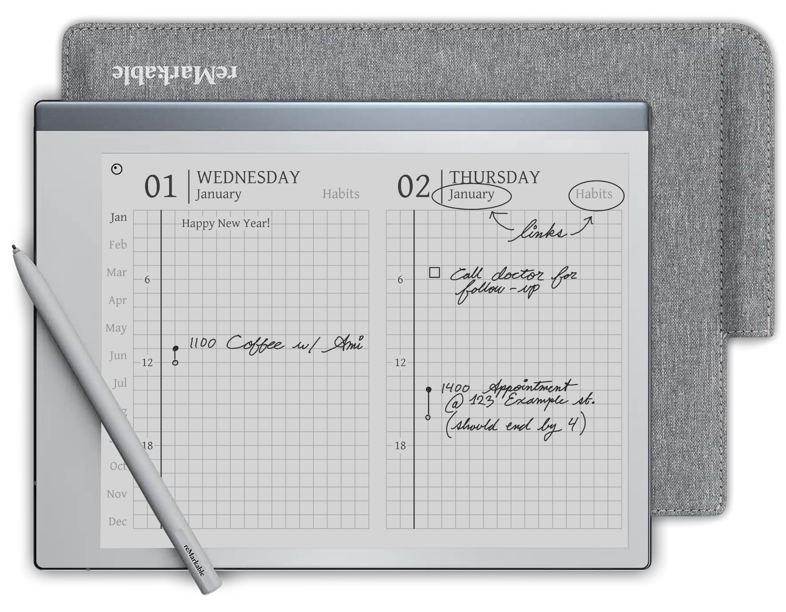

# ReMarkable Calender




## Contents

- [What is this?](#what-is-this)
    - [Features](#features)
- [How do I use this?](#how-do-i-use-this)
- [Using the creation script](#using-the-creation-script)
    - [Prerequisites](#prerequisites)
    - [Setup](#setup)
    - [Usage](#usage)
    - [Customization](#customization)

## What is this?

A minimal PDF calendar for the ReMarkable 2, inspired by the Hobonichi Techo planner. This PDF calendar is created using a script but a pre-made calendar can be [downloaded from here](https://github.com/elainajones/remarkable-calendar/releases/latest).

### Features

- Optional PDF creation script for custom date ranges.
- Clickable dates for fast navigation!
    - From the month view, click the dates to jump to the corresponding day view page.
    - From the day view, click the month name to jump to the corresponding month view page.
- Hour rulings for each day.
- 1:1 scaling suitable for print.
- A4 document size (also supports US letter)
- 5.5mm grid line spacing
- [Gentium Font](https://software.sil.org/gentium/)
- Spaghetti code?

## How do I use this?

To use, simply download a copy of the PDF. Once copied to the ReMarkable 2, open the PDF and set the viewing for landscape mode. Be sure to set the page scaling to fit the screen width.

Continue reading for instructions using the code included in this repository.

## Using the creation script

### Prerequisites

- [Python3](https://www.python.org/downloads/)
- [Git](https://git-scm.com/downloads)
- Basic familiarity with Python
- Basic familiarity with running shell commands

### Setup

1. Ensure that both Git and Python3 have been installed.
2. `git clone https://github.com/elainajones/remarkable-calendar.git`
    - This will download the code locally on your machine.
3. `cd remarkable-calendar`
4. `python3 -m venv venv`
    - This will create a [Python3 virtual environment](https://docs.python.org/3/library/venv.html).
5. `.\venv\Scripts\activate`
    - `(venv)` should appear in the shell.
    - Linux users only: `. venv/bin/activate`
6. `python3 -m pip install -r requirements.txt`
    - This will install necessary dependencies.

### Usage

The simplest way to run the code is to enter the following command. The current
year will be automatically determined from your computer's date settings.

```
python3 main.py
```

A calendar PDF will be saved locally as `calendar.pdf`.

### Customization

The `-h` or `--help` option can be added to the end of the command to show additional options.

```
python3 main.py --help
```

This includes the following options to customize the date range.

- `--start-date`
    - Human readable date with support for multiple formats
    - eg: `'2024/09/27'` or `'Sept 9, 2024'` (make sure to enclose inside `'`)
- `--end-date`
    - Human readable date with support for multiple formats
    - eg: `'2024/09/27'` or `'Sept 9, 2024'` (make sure to enclose inside `'`)

Advanced users familiar with Python can customize the font by providing their own font files.
